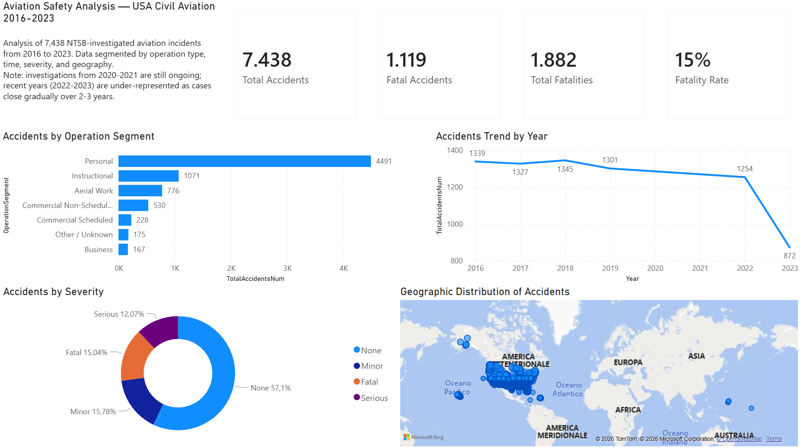

# NTSB Aviation Safety Analysis 2016-2023

End-to-end analysis of US civil aviation accidents from the NTSB CAROL database (7,438 incidents), from raw-data cleaning in Python to an interactive dashboard in Power BI.



📄 **[Download the full dashboard as PDF](aviation_dashboard.pdf)** · 📁 **[Open the .pbix file in Power BI Desktop](aviation_safety_dashboard.pbix)**

---

## Project goals

- Identify where risk actually concentrates in US civil aviation, and challenge the perception bias driven by media coverage of airline crashes.
- Quantify the share of accidents that result in fatalities, and surface high-severity outlier events.
- Map the geographic distribution of accidents and explore segment-level patterns (commercial vs general aviation).
- Be transparent about what the dataset covers — and what it does not.

## Tech stack

- **Python 3.14** (pandas) — data cleaning and feature engineering
- **Jupyter Notebook** (in VS Code) — exploratory workflow
- **Power BI Desktop** — interactive dashboard with DAX measures and Bing Maps integration

## Repository structure

```
ntsb-aviation-safety-analysis/
├── 01_data_cleaning.ipynb         # Cleaning + feature engineering notebook
├── data/
│   ├── aviation_raw.csv           # Source dataset (NTSB via Zenodo)
│   └── aviation_clean.csv         # Cleaned dataset, input for Power BI
├── aviation_safety_dashboard.pbix # Power BI dashboard file
├── aviation_dashboard.pdf         # Static PDF export of the dashboard
├── dashboard_preview.png          # PNG preview rendered in this README
└── README.md
```

## Data source and important caveat

The dataset comes from the NTSB CAROL Query system, aggregated for 2016-2023 and published on Zenodo. It contains 7,462 accident reports (filtered to 7,438 after restricting to incidents on US territory).

**Critical limitation**: aviation accident investigations typically take 2-3 years to close. The Zenodo snapshot was taken in late 2024, which means **2020 and 2021 are essentially absent** from the data, and **2022-2023 are under-represented**. This is not a real-world drop in accident rate — it is a reporting lag. The dashboard surfaces this caveat explicitly rather than hiding it: a junior analyst who silently shows a "COVID dip" that isn't there is a junior analyst who hasn't read their own data.

## Data cleaning — what was done and why

The raw CSV looked clean at first pass (`isnull().sum()` reported low NaN counts), but a closer inspection surfaced several problems that required deliberate decisions.

**1. The CSV was a quoted, semicolon-separated file with embedded newlines.** A naive `pd.read_csv()` failed at line 124 because the `rep_text` column contained full PDF report transcripts with line breaks inside cells. The fix required `engine="python"`, `sep=";"`, and `quotechar='"'`.

**2. The dataset weighed 169 MB in memory** because of those embedded report texts. Dropping irrelevant heavy columns (`rep_text`, `ProbableCause`, `Findings`, plus several IDs and reporting flags) brought it down to ~6 MB — the same dataset, but actually usable.

**3. `HighestInjuryLevel` had 57% NaN values.** Rather than imputing blindly, I cross-checked: every NaN row had `FatalInjuryCount = 0` and `SeriousInjuryCount = 0`. The NaN therefore meant "No injury reported" — a missing label, not missing data. Imputed to "None" and converted to an ordered categorical so that downstream tools respect the severity hierarchy (None < Minor < Serious < Fatal).

**4. Manufacturer names were inconsistent** ("Cessna" / "CESSNA" / "Cessna Aircraft Inc."). Normalized to uppercase, stripped corporate suffixes (INC/LLC/CORP/...), and discovered through iteration that "ROBINSON HELICOPTER" and "ROBINSON" were the same entity recorded inconsistently — a second pass merged the two (227 incidents combined, the dataset's 4th-most-frequent manufacturer).

**5. `EventDate` was ISO 8601 with timezone.** Converted to datetime and derived `Year`, `Month`, `Quarter`, and `YearMonth` for time-series visuals in Power BI.

## Feature engineering

The most important derived feature is **`OperationSegment`** — a 7-class classification combining the `Scheduled` (SCHD/NSCH) and `PurposeOfFlight` (PERS/INST/BUS/AAPL/...) columns into business-meaningful buckets:

- Commercial Scheduled (airline industry)
- Commercial Non-Scheduled (charter, air taxi)
- Personal (private leisure flying)
- Instructional (flight schools)
- Business (corporate flying with private pilot)
- Aerial Work (agriculture, surveillance, ferry, skydiving, flight test)
- Other / Unknown

This segmentation mirrors how aviation regulators (FAA, EASA) and safety analytics firms talk about risk. It is the feature that makes the central narrative of this project legible.

A `TotalInjuries` field was also added as the row-wise sum of fatal, serious, minor, and on-ground injury counts — useful as a severity proxy in Power BI.

## Dashboard structure

The dashboard is laid out as a single page with a top-down narrative.

**Header** — title, dataset coverage note, and the four KPIs that frame the problem: total accidents (7,438), fatal accidents (1,119), total fatalities (1,882), and fatality rate (15%).

**Operation segment view** — horizontal bar chart of accidents by operation segment, sorted descending. Personal aviation alone accounts for 4,491 incidents — about 60% of the dataset — while commercial scheduled flights account for only 228 (3%).

**Time trend** — line chart of accidents per year, with the 2020-2021 gap and the 2022-2023 under-representation visible (and explained in the dashboard subtitle).

**Severity breakdown** — donut chart of accidents by injury level: 57% None, 16% Minor, 12% Serious, 15% Fatal.

**Geographic map** — Bing Maps visual plotting all 7,438 events by latitude/longitude, with Alaska, the contiguous US flight corridors (California, Texas, Florida, Northeast), Hawaii, and the US Pacific territories all visible as cluster patterns.

## Key findings

- **Risk perception is inverted from risk reality.** Airline crashes dominate news coverage, but commercial scheduled flights are 3% of accidents in the dataset. Personal aviation is 60%. The places where the industry should invest in safety improvements are not where the cameras point.
- **Fatality rate is 15%** — roughly one in seven NTSB-investigated incidents results in at least one fatality. This is materially higher than the public mental model of "aviation = safe", because the public model is calibrated to airlines, not to general aviation.
- **A single outlier (Southwest 1380, April 2018) accounts for 134 of the dataset's injuries** — a CFM56 fan blade containment failure on a Boeing 737 that killed one passenger and injured ~133 others. A reminder that even mature, well-regulated aviation segments are exposed to rare-but-extreme tail events.
- **Geographic distribution is highly uneven.** Alaska shows a disproportionate accident count for its population because aviation there is a primary mode of transport, not a leisure activity. Hot-spot states (CA, TX, FL) align with general aviation activity rather than airline traffic.

## Limitations and next steps

- **No exposure data.** The dataset reports incidents but not flight hours per segment. A flight-hour denominator would convert frequency into a true risk rate (incidents per 100,000 flight hours), which is the metric the industry actually uses.
- **2020-2021 are absent and 2022-2023 are partial** due to investigation reporting lag. Any time-trend interpretation must account for this.
- **`Make` field is still noisy** despite normalization — name variants and helicopter/UAV combinations from multi-aircraft accidents would benefit from a deeper cleaning pass.
- A natural extension: classify accidents by phase of flight (`BroadPhaseofFlight`, already in the cleaned data) and weather (`WeatherCondition`) to map the operational context of the riskiest segments.

---

## About me

**Federico Ordonselli** — aspiring data analyst with a background in aviation security at Rome Fiumicino Airport.
🔗 [LinkedIn](INSERISCI_QUI_IL_TUO_LINK_LINKEDIN)
